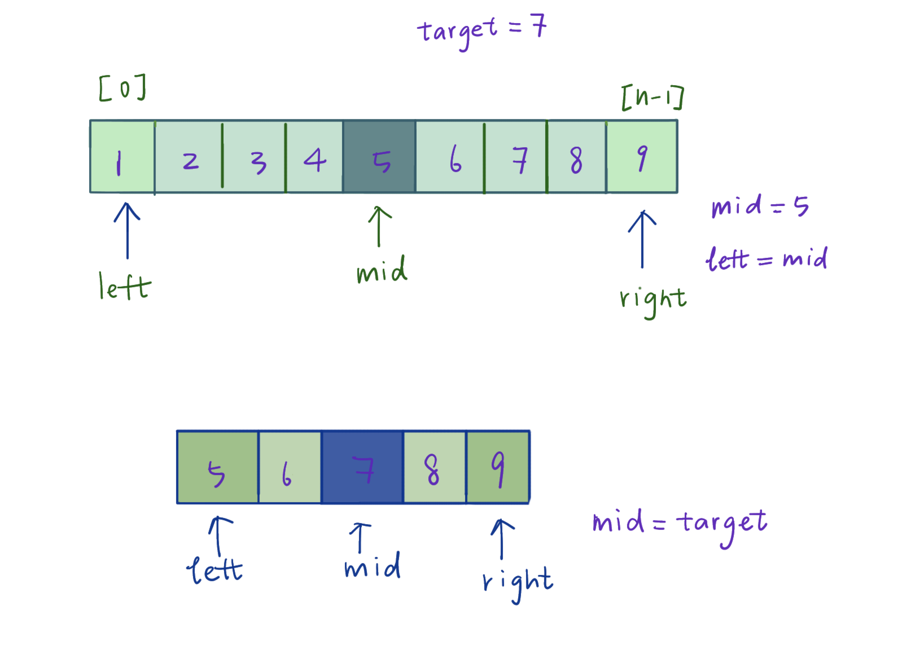
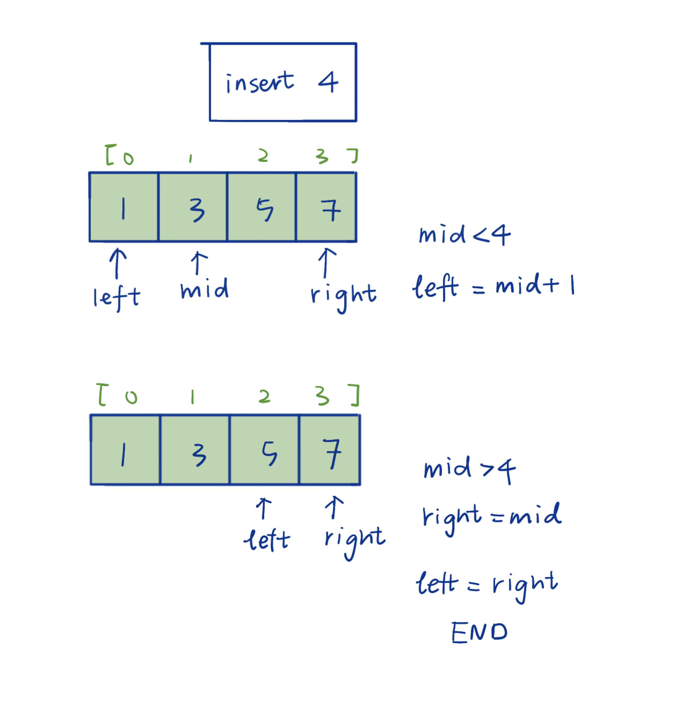

# Binary Search

Binary Search is a powerful algorithm for allocating item in a sorted array. It efficiently reduce the size of a problem while solving it, with two pointers used to reduce the searching area. Binary Search is also widely applied in daily life, such as Price Guessing Game. 

## Binary Search vs. Linear Search

|                                | Binary Search | Linear Search        |
| ------------------------------ | ------------- | -------------------- |
| **Worst case time complexity** | O(logN)       | O(N)                 |
| **Array type**                 | Sorted        | No Need to be Sorted |
|                                |               |                      |

## Binary Search Methods

### Templates 1: Searching for Existing Element

Known the target element is in the array, search its position.


#### Description

- Set up pointers `left` and `right`
- Find the middle element `mid`
  - If `mid` equals target element, return directly.
  - if `mid` is lower than target, set `left` as `mid` and research its right side.
  - if `mid` is higher than target, set `right` as `mid` and research its left side.

#### Example

[Leetcode 0704 - Binary Search](https://leetcode.com/problems/binary-search/)

```python
def search(nums: [int], target: int) -> int:
    left = 0
    right = len(nums) - 1
    
    #including the search when left == right
    while left <= right:
        # take left-mid
        """important：to avoid （left + right） overflow from the range of numbers"""
        mid = left + (right - left) // 2

        if nums[mid] == target:
            return mid
        elif nums[mid] < target:
          # search area [mid+1, right]
            left = mid + 1
        else:
          # search area [left, mid - 1]
            right = mid - 1

    return -1
```

###### Notes

1. `while left <= right`: need to search one more time for the element when `left == right`
2. `mid = left + (right - left) // 2` floors division to the left. Depending on question requirement, ceiling to the right can be simply done by adding 1.

### Templates 2: Searching for inserting place of Non-existing Element

Searching for the postion to insert the new element without breaking the order of the array.


#### Description

- Set up pointers `left` and `right` 

  Need to pay attention to the value on the boarder, otherwise may excluding the element and return error.

- Find the middle element `mid` and compare `mid` with target

  - if `mid` is lower than target, set `left` as `mid + 1` and research its right side.
  - if `mid` is higher than target, set `right` as `mid` and research its left side.

#### Example

[Leetcode 0035 - Search Insert Position](https://leetcode.com/problems/search-insert-position/)

```python
def searchInsert(nums: [int], target: int) -> int:
    left = 0
    right = len(nums) - 1
    while left < right:
        mid = left + (right - left) // 2

        if nums[mid] == target:
            return mid

        if nums[mid] > target:
            right = mid
        else:
            left = mid + 1

    # find the place to insert if target not in the list
    if nums[left] < target:
        return left + 1
    else:
        return left
```

###### Important: Avoid dead loop.

While reducing the area, whether floor or ceil mid is very important in terms of avoiding dead loop

1. `mid` belongs to the left and divides the searching area into two parts: `[left, mid]` and `[mid + 1, right]`, then for next round of search, the area would need to be

   ```python
   # floor mid
   mid = left + (right - left) // 2
   if check(mid):
     left = mid + 1
   else:
     right = mid
   ```

2. `mid` belongs to the right and divides the searching area into two parts: `[left, mid - 1]` and `[mid, right]`

   ```python
   #ceil mid
   mid = left + (right - left) // 2 + 1
   if check(mid):
     left = mid
   else:
     right = mid - 1
   ```

*Note:  print out left, mid and righ is very helpful for debugging* 

## Useful Library

### python

[bisect](https://docs.python.org/3/library/bisect.html): Bisect library allows direct use of bisection. Detailed usage and examples are well documented.

### C++

`iterator lower_bound( const key_type &key )`: return the position of the first element <= target

`iterator upper_bound( const key_type &key )`: return the position of the first element >= target

