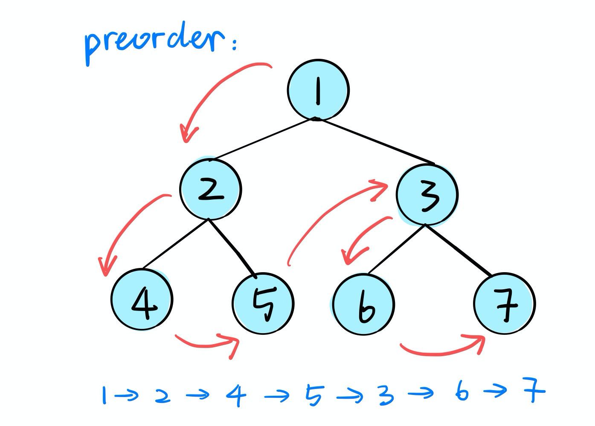
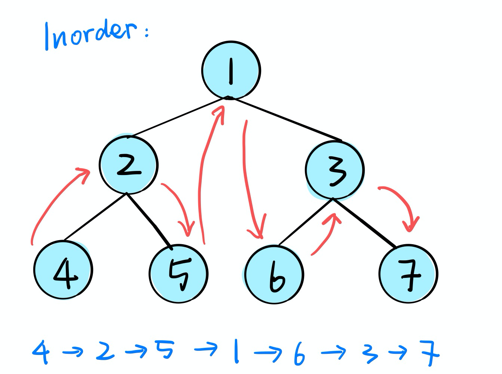
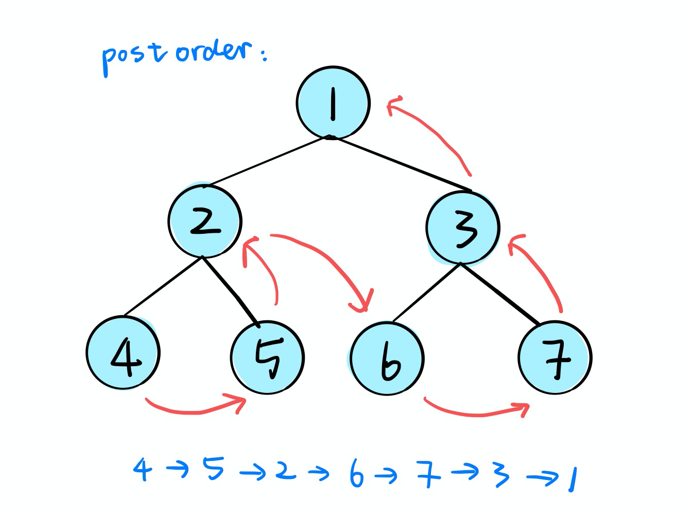
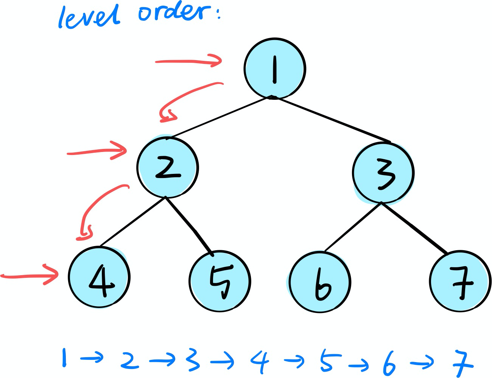

# Binary Tree Traversal

Tree traversal in an important data structure and can be applied in various data structures and algorithms. Here we will focus on binary  tree and discuss the different traversal methods.

## Traversal Methods

- [Preorder Traversal](#preorder-traversal) :  Root - Left - Right
- [Inorder Traversal](#inorder-traversal) ：Left - Root - Right
- [Postorder Traversal](#postorder-traversal) ：Left - Right - Root
- [Level order Traversal](#level-order-traversal): Breadth-First Search (BFS)

###### TreeNode Class:
```python
class TreeNode(object):
    def __init__(self, x):
        self.val = x
        self.left = None
        self.right = None
```

### Preorder Traversal



#### Algorithms:

##### 1. Recursion:

```python
class Solution:
	def preorderRecur(self, root:TreeNode) -> List[int]:
        res = []
        def curr(root):
            if not root:
                return None
            # in the order of root - left - right 
            res.append(root.val)
            curr(root.left)
            curr(root.right)
       
        curr(root)
        return res
```


##### 2. DFS(stack)

```python
class Solution:
    def preorderDFS(self, root: TreeNode) -> List[int]:
        res = []
        stack = []
        if not root:
            return res
        stack.append(root)
        while stack:
            node = stack.pop()
            if node:
                res.append(node.val)
                # push right first, pop left first
                stack.append(node.right)
                stack.append(node.left)
        return res
```


### Inorder Traversal


#### Algorithms:

##### 1. Recurrsion:

```python
class Solution:
	def inorderRecur(self, root:TreeNode) -> List[int]:
    res = []
    def curr(root):
      if not root:
        return None
      # in the order of left - root - right 
      curr(root.left)
      res.append(root.val)
      curr(root.right)
   
  	curr(root)
    return res
```


##### 2. DFS(stack)

```python
class Solution:
    def inorderDFS(self, root: TreeNode) -> List[int]:
        res = []
        stack = []
        while True:
            while root:
                stack.append(root)
                root = root.left
            if not stack:
                return res
            root = stack.pop()
            res.append(root.val)
            root = root.right
        return res
```


### Postorder Traversal


#### Algorithms:

##### 1. Recurrsion:

```python
class Solution:
	def postorderRecur(self, root:TreeNode) -> List[int]:
    res = []
    def curr(root):
      if not root:
        return None
      # in the order of left - right - root
      curr(root.left)
      curr(root.right)
      res.append(root.val)
   
  	curr(root)
    return res
```


##### 2. DFS(stack)

```python
class Solution:
    def postorderDFS(self, root: TreeNode) -> List[int]:
        res = []
        stack = []
        if not root:
            return res
        stack.append(root)
        while stack:
            node = stack.pop()
            if node:
                res.append(node.val)
                stack.append(node.left)
                stack.append(node.right)
        return res[::-1]
```


### Level Order Traversal


#### Algorithms: DFS(stack)

```python
class Solution:
  def levelOrder(self, root: TreeNode) -> List[[int]]:
      # if the tree is empty
      if not root:
          return []

      result = []
      level = deque()
      level.append(root)

      while level:
          curr_level = []
          # store the length of current level (unnecessary for python but needed for other language
          a = len(level)
          for _ in range(a):  # traversal the current level
              node = level.popleft()
              curr_level.append(node.val)
              if node.left:
                  level.append(node.left)
              if node.right:
                  level.append(node.right)
          result.append(curr_level)
      return result
```
