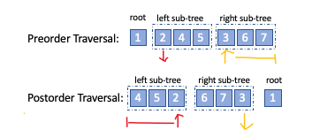

# Construct Binary Tree from Traversals

Following the methods of Binary Traversal, it is also important that we are familiar with how to reconstruct a binary tree given its different form of traversal.

This post includes three different combinations of given traversals and the algorithms we used to build a unique binary tree.
## Traversal Methods
First of all, it is vital that we are familiar with the traversal methods of a given binary tree. 
Related explanations and code implementations can be found in my other post: 

[Binary Tree Traversal](binary_tree_traversal.md)

## Combinations of traversals
- [Preorder and Inorder Traversal](#preorder-and-inorder-traversal) :  [LeetCode 105](0105_construct_binary_tree_from_preorder_and_inorder_traversal.py)
- [Inorder and Postorder Traversal](#inorder-and-postorder-traversal) :  [LeetCode 106](0106_construct_binary_tree_from_inorder_and_postorder_traversal.py)
- [Preorder and Postorder Traversal](#preorder-and-postorder-traversal) :  [LeetCode 889](0889_construct_binary_tree_from_preorder_and_postorder_traversal.py)

> Note:
>   For the above methods, we assume that duplicates do not exist in the tree in the first place.
>
###### TreeNode Class:
```python
class TreeNode(object):
    def __init__(self, x):
        self.val = x
        self.left = None
        self.right = None
```

## General Method Description
Preorder traversal:  Root - Left - Right

Inorder traversal：Left - Root - Right

Postorder traversal：Left - Right - Root


## Preorder and Inorder Traversal
### Description
1. Use preorder to find the root value (first element)
2. Locate the root value in inorder, dividing the left and right sub-trees from the inorder list.
3. Recursion through the sub-tree to construct the whole tree

### Code Implementations
```python
def buildTree(preorder: List[int], inorder: List[int]) -> TreeNode:
    def dfs(pre_left, pre_right):
        # i and j and both closed interval
        if pre_left > pre_right:
            return None

        # first element in preorder is the current root
        root_val = preorder.pop(0)
        root = TreeNode(root_val)
        # locate the root in inorder
        root_index = inorder.index(root_val)

        root.left = dfs(pre_left, root_index - 1)
        root.right = dfs(root_index + 1, pre_right)

        return root

    return dfs(0, len(inorder) - 1)
```
> Complexity:
>
> Time complexity: O(n*2) due to list.index() function
>
> Space complexity: O(n)

#### Time complexity Optimization with HashMap
Store the index of elements in the inorder list into a hashmap so that the search time would then be reduced to O(1) 
```python
def buildTree(preorder: List[int], inorder: List[int]) -> TreeNode:
    def dfs(pre_left: int, pre_right: int):
        # pre_left and pre_right and both closed interval
        if pre_left > pre_right:
            return None
            
        # first element in preorder is the current root
        pre_root = pre_left
        # locate the root in inorder hashmap
        root_index = index[preorder[pre_root]]
        
        root = TreeNode(preorder[pre_root])
        root.left = dfs(pre_left, root_index - 1)
        root.right = dfs(root_index + 1, pre_right)
        return root
        
    n = len(preorder)

    # build hashmap for inorder
    index = {element: i for i, element in enumerate(inorder)}

    return dfs(0, n - 1)
```

> Complexity:
>
> Time complexity: O(n * 1) = O(n)
>
> Space complexity: O(n)

## Inorder and Postorder Traversal
### Description
1. Use postorder to find the root value (last element)
2. Locate the root value in inorder, dividing the left and right sub-trees from the inorder list.
3. Recursion through the sub-tree to construct the whole tree

### Code Implementation
```python
def buildTree(inorder: List[int], postorder: List[int]) -> TreeNode:
    def dfs(i, j):
        # i, j are both closed end boundary
        if i > j:
            return None

        # the last value in postorder is the current root value
        root_val = postorder.pop()
        root = TreeNode(root_val)

        # locate the root in inorder hashmap
        root_index = index[postorder[root_val]]

        # construct right subtree first
        root.right = dfs(root_index + 1, j)
        # then construct left subtree
        root.left = dfs(i, root_index - 1)

        return root

    n = len(inorder)
    index = {element: i for i, element in enumerate(postorder)}

    return dfs(0, n - 1)
```

> Complexity:
>
> Time complexity: O(n * 1) = O(n)
>
> Space complexity: O(n)

## Preorder and Postorder Traversal
### Description

1. Use preorder to find the root value (first element)
2. The second element would be the left sub-tree root, use it in post order to get the length of left subtree
3. Divide preorder and postorder, recursion through the sub-lists

### Code Implementation
```python
def constructFromPrePost(pre: List[int], post: List[int]) -> TreeNode:
    if not pre:
        return None

    root = TreeNode(pre[0])

    # reach leaf node
    if len(pre) == 1:
        return root

    # length of left subtree
    num_nodes = post.index(pre[1]) + 1

    root.left = constructFromPrePost(pre[1:num_nodes + 1], post[:num_nodes])
    root.right = constructFromPrePost(pre[num_nodes + 1:], post[num_nodes:-1])
    return root
```

> Complexity:
>
> Time complexity: O(n*2)
>
> Space complexity: O(n*2)
>

#### Optimization on Space Complexity
We use pointers instead of sub-arrays for recursion to save space.
Here `(i0, i1, N)` stands for `pre[i0:i0+N]`, `post[i1:i1+N]`.
```python
def constructFromPrePost(self, pre, post):
    def dfs(i0, i1, N):
        if N == 0: return None
        root = TreeNode(pre[i0])
        if N == 1: return root

        for L in xrange(N):
            if post[i1 + L - 1] == pre[i0 + 1]:
                break

        root.left = dfs(i0 + 1, i1, L)
        root.right = dfs(i0 + L + 1, i1 + L, N - 1 - L)
        return root

    return dfs(0, 0, len(pre))

```
> Complexity:
>
> Time complexity: O(n*2)
> Space complexity: O(n)
>

## Reference
> 1. https://leetcode-cn.com/problems/construct-binary-tree-from-preorder-and-inorder-traversal/solution/cong-qian-xu-yu-zhong-xu-bian-li-xu-lie-gou-zao-9/
> 2. https://leetcode-cn.com/problems/construct-binary-tree-from-preorder-and-postorder-traversal/solution/gen-ju-qian-xu-he-hou-xu-bian-li-gou-zao-er-cha-sh/
> 