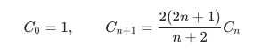

# Dynamic Programming

Dynamic programming is a method which solves problems by combining the solutions to subproblems. We typically apply this method to optimization problems and when the subproblems overlap to avoid recomputing the answer. 

## Steps

- Define the state of the optimal solution
- Define the state transition function
- Initialization of the table
- recursively define the value of solutions for each subproblems
- Construct the optimal solution from the computed tabular solutions

## Recursive Manners

- **Top-down implementation**:

  Memoization (recording a value for later look-up), result for each subproblem usually stored in an array or hash table.

- **Bottom-up method (recommanded for most DP problems):**

  Sovle the smaller problems whose result is required when computing larger subproblems.

## DP Models

### Linear DP

#### Example Question:

[Leetcode 0120 - Triangle](https://leetcode.com/problems/triangle/)
> Given a triangle, find the minimum path sum from top to bottom. Each step you may move to adjacent numbers on the row below.
>
> For example, given the following triangle:
>
>[
>      [2],
>     [3,4],
>    [6,5,7],
>   [4,1,8,3]
> ]
> The minimum path sum from top to bottom is 11 (i.e., 2 + 3 + 5 + 1 = 11).

##### Top-down method：
**Step 1: Define the state**
`dp[i][j]` is the path sum from top to `triangle[i][j]`.

**Step 2: Define the state transition function**
The optimal result for subproblem, minimum path sum to the current position, can be calculated as follow
`dp[i][j] = min(dp[i - 1][j - 1], dp[i - 1][j]) + triangle[i][j]`

**Step 3: Initialization of the table**
Top: `dp[0][0] = triangle[0][0]`
Left Edge: `dp[i][0] = dp[i - 1][0] + triangle[i][0]`
Right Edge: `dp[i][i] = dp[i - 1][i - 1] + triangle[i][i]`

**Step 4: Recursion range**
For each level, recurse within the range(1, i) to avoid boarder exception.

**Step 5: Construct optimal solution**
`min(dp[n - 1])`

##### Bottom-up method：
**Step 1: Define the state**
`dp[j]` is the path sum from bottom to `triangle[current level][j]` and is refreshed for each level.

**Step 2: Define the state transition function**
The optimal result for subproblem, minimum path sum to the current position, can be calculated as follow
`dp[j] = triangle[current][j] + min(dp[j], dp[j + 1])`

**Step 3: Initialization of the table**
Start: `dp = triangle[n-1]`
No need to consider boarders as exceptions

**Step 4: Recursion range**
Recurse through each level from second-bottom `triangle[i-1]`

**Step 5: Construct optimal solution**
`dp[0]`, which is the top tip

### Counting DP
This type of questions can be solved with combining mathematical methods.

#### Example Question:

[Leetcode 0096 - Unique Binary Search Trees](https://leetcode.com/problems/unique-binary-search-trees/)
> Given n, how many structurally unique BST's (binary search trees) that store values 1 ... n?
> Example:
> Input: 3
Output: 5
Explanation:
Given n = 3, there are a total of 5 unique BST's:
   1         3     3      2      1
    \       /     /      / \      \
     3     2     1      1   3      2
    /     /       \                 \
   2     1         2                 3
>

##### DP Method:
```python
class Solution:
    def numTrees(self, n: int) -> int:
        dp = [0 for _ in range(n + 1)]
        dp[0], dp[1] = 1, 1
        for i in range(2, n + 1):
            for j in range(0, i):
                # result for i values is the combination of possibility till j and (j, i)
                dp[i] += dp[j] * dp[i - j - 1]
        print(dp)
        return dp[-1]
```
Notes:
- `dp[i]` stored the number of unique BST for value (0,i)
- transfer function: `dp[i] += dp[j] * dp[i - j - 1]` combination of two sub problems
- for each value `i`, it is necessary to calculate all the possibility beforehand, thus itierate `j in range(0,i)`

##### Mathematical Method:
```python
class Solutioin:
    def numTreesCatalan(self, n: int) -> int:
        # mathematical method: Catalan Number
        c = 1
        for i in range(n):
            c = c * 2 * (2 * i + 1) / (i + 2)
        return c
```

Catalan Number: 


### Interval DP

#### Example Question:

[Leetcode 0312 - Burst Balloons](https://leetcode.com/problems/burst-balloons/)
> Given n balloons, indexed from 0 to n-1. Each balloon is painted with a number on it represented by array nums. You are asked to burst all the balloons. If the you burst balloon i you will get nums[left] * nums[i] * nums[right] coins. Here left and right are adjacent indices of i. After the burst, the left and right then becomes adjacent.
>Find the maximum coins you can collect by bursting the balloons wisely.
>Note:
>
>You may imagine nums[-1] = nums[n] = 1. They are not real therefore you can not burst them.
0 ≤ n ≤ 500, 0 ≤ nums[i] ≤ 100
Example:
>
>Input: [3,1,5,8]
Output: 167
Explanation: nums = [3,1,5,8] --> [3,5,8] -->   [3,8]   -->  [8]  --> []
             coins =  3*1*5      +  3*5*8    +  1*3*8      + 1*8*1   = 167
>
```python
class Solution:
    def maxCoins(self, nums: List[int]) -> int:
        n = len(nums)
        if not nums:
            return 0

        # add front end balloons num = 1
        dp = [[0 for _ in range(n + 2)] for _ in range(n + 2)]
        nums = [1] + nums + [1]

        # reversed dp
        for left in range(n, -1, -1):
            for right in range(left + 1, n + 2):
                for i in range(left + 1, right):
                    # find the maximum value for this interval
                    dp[left][right] = max(dp[left][right],
                                          nums[i] * nums[left] * nums[right] + dp[left][i] + dp[i][right])

        return dp[0][-1]
```
##### Solving small subproblems required from larger interval：
**Step 1: Define the state**
`dp[left][right]` is the max coin gained within interval `(left, right)` 

**Step 2: Define the state transition function**
The optimal result for subproblem can be calculated as follow, where `i` is iterate through each element between `left` and `right`,
`dp[left][right] = max(dp[left][right], nums[i] * nums[left] * nums[right] + dp[left][i] + dp[i][right])`

**Step 3: Initialization of the table**
Start: add element `1` to both ends to avoid boarder conflict

**Step 4: Recursion range**
When solving larger interval, the result of smaller interval is required.
Thus, we should start from left at the right end, i.e. from the smallest interval

**Step 5: Construct optimal solution**
`dp[0][-1]`, which is the whole list of balloons, largest interval we calculated